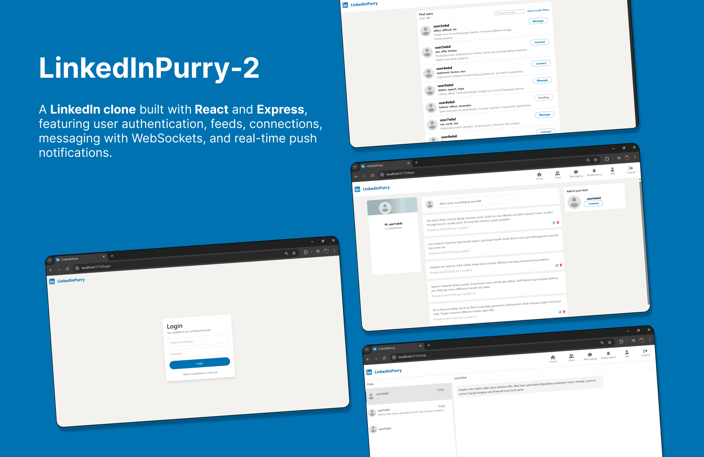

# Milestone 2 - IF3110 Pengembangan Aplikasi Web LinkedInPurry-2

<div style="width: 70%; margin: 0 auto;">
  
</div>

## Web Description

LinkedInPurry is a web-based social media platform designed to help professionals expand their networks, share career-related information, and provide opportunities for real-time interaction with colleagues and industry peers. This system will be developed with a focus on responsive and efficient user experience using modern technologies such as REST API, React, WebSocket, and server-side notification techniques.

### Key Features:

#### REST API Backend (Node.js)

LinkedInPurry utilizes a REST API built with Node.js as the main backend, handling all the business logic of the application. This API allows seamless communication between the frontend and backend, ensuring smooth data management and interaction across the platform.
All API endpoints will be optimized for high performance and fast responses.
Real-Time Chat with WebSocket

Users can interact directly with colleagues, industry peers, or potential business partners through real-time chat functionality. By using the WebSocket protocol, communication between users happens instantly without any noticeable delay.
Notifications with Server-Sent Events and Service Worker

To enhance the interactive experience, LinkinPurry will implement notifications using Server-Sent Events (SSE), which allows notifications to be pushed from the server to the client in real-time. With the use of Service Worker, the application can send push notifications even when the user is not actively on the platform.
Single Page Application (SPA) with React

The frontend of LinkinPurry will be developed using React, a modern JavaScript library for building user interfaces. React will allow the platform to provide a fast and responsive user experience without the need for page reloads, ensuring dynamic interactions throughout the app.
Data Storage and Management with PostgreSQL

User data and career-related information will be stored and managed using PostgreSQL, a robust and scalable relational database management system. An ORM such as Prisma will be used to simplify database management.
Stress Testing and Load Testing

To ensure the platform can handle high usage loads, stress testing and load testing will be conducted on several API endpoints. This will ensure that LinkinPurry operates smoothly and efficiently, even when many users access the platform simultaneously.
Technologies Used:

- Backend: Node.js, Express, WebSocket
- Frontend: React, Vite, TailwindCSS (for styling)
- Database: PostgreSQL, Prisma
- Notifications: Server-Sent Events, Service Worker
- Testing: Stress Testing, Load Testing

#### Key Challenges:

Ensuring the security and performance of the API, including protection against DDoS attacks and optimizing for high traffic handling.
Building responsive real-time communication using WebSocket.
Efficiently managing data and structuring the database to be scalable and maintainable.
Creating an intuitive and responsive user interface with React to provide a smooth, interruption-free experience for users.
LinkinPurry is focused on simplicity and effectiveness in connecting professionals worldwide, making it the go-to platform for career-building, knowledge-sharing, and collaboration in the workplace. By leveraging the latest technologies, this application will offer not only a functional experience but also an enjoyable one for its users.

## How to Run

Follow these steps to get started:

1. **Clone the repository**:

```sh
git clone https://github.com/Labpro-21/if-3310-2024-2-k03-13
```

2. **Navigate to the repository root directory**:

```sh
cd if-3310-2024-2-k03-13
```

3. **Run the Docker container (ensure Docker Desktop is running)**:

```sh
docker-compose up --build
```

4. **Access the available ports**:

- `localhost:5173` : frontend
- `localhost:3000` : backend
- `localhost:6379` : redis
- `localhost:5432` : postgres
- `localhost:5555` : prisma studio

## Person responsible of the task

| Fitur                            | Penanggung Jawab  |
| -------------------------------- | ----------------- |
| Authentication dan Authorization | 13522149          |
| Profil Pengguna                  | 13522145          |
| Koneksi antar Pengguna           | 13522137          |
| Feed                             | 13522145          |
| Chat dan websocket               | 13522137          |
| Notifikasi                       | 13522137          |
| Stress dan load test             | 13522137          |
| Responsivitas                    | 13522145,13522149 |
| Docker                           | 13522137          |
| Dokumentasi API                  | 13522137          |
